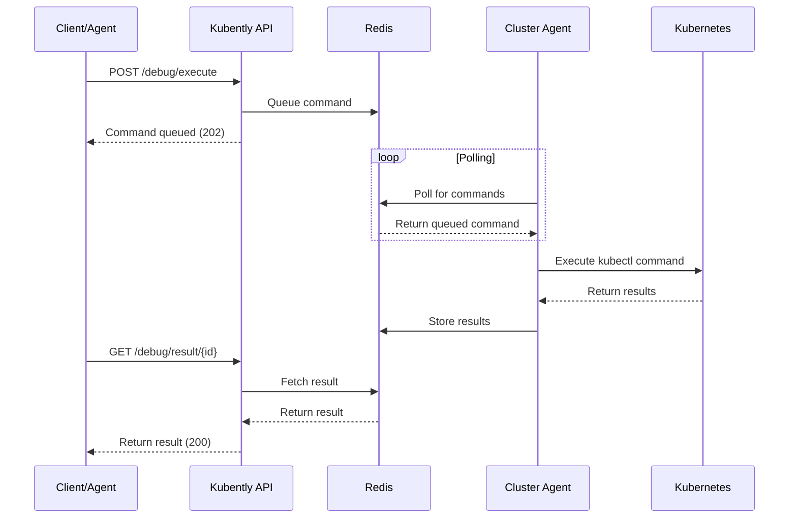

# Architecture

Kubently is designed as a distributed system that provides real-time, secure access to Kubernetes cluster debugging capabilities through a simple API interface.

## System Overview

```
┌─────────────────┐    ┌─────────────────┐    ┌─────────────────┐
│   AI Agents     │    │    Users        │    │  External       │
│   or Services   │    │                 │    │  Monitoring     │
└─────────────────┘    └─────────────────┘    └─────────────────┘
         │                       │                       │
         ▼                       ▼                       ▼
┌─────────────────────────────────────────────────────────────────┐
│                    Kubently API Gateway                        │
│  ┌─────────────┐  ┌─────────────┐  ┌─────────────────────────┐ │
│  │    Auth     │  │   Session   │  │      Command            │ │
│  │   Module    │  │   Manager   │  │      Router             │ │
│  └─────────────┘  └─────────────┘  └─────────────────────────┘ │
└─────────────────────────────────────────────────────────────────┘
                               │
                               ▼
                    ┌─────────────────┐
                    │      Redis      │
                    │   State Store   │
                    └─────────────────┘
                               ▲
                               │ (Pub/Sub + Polling)
        ┌──────────────────────┼──────────────────────┐
        │                      │                      │
        ▼                      ▼                      ▼
┌─────────────┐    ┌─────────────┐    ┌─────────────┐
│   Cluster   │    │   Cluster   │    │   Cluster   │
│   Agent A   │    │   Agent B   │    │   Agent C   │
└─────────────┘    └─────────────┘    └─────────────┘
        │                      │                      │
        ▼                      ▼                      ▼
┌─────────────┐    ┌─────────────┐    ┌─────────────┐
│ Kubernetes  │    │ Kubernetes  │    │ Kubernetes  │
│  Cluster A  │    │  Cluster B  │    │  Cluster C  │
└─────────────┘    └─────────────┘    └─────────────┘
```

## Core Components

### Kubently API (Central Service)

The API service is the central orchestration point that handles all external requests and coordinates with cluster agents.

**Key Responsibilities:**
- Authentication and authorization
- Session lifecycle management
- Command routing and queuing
- Result aggregation and caching
- Rate limiting and security controls

**Technology Stack:**
- **Framework**: FastAPI (Python)
- **Authentication**: JWT tokens and API keys
- **Serialization**: Pydantic models
- **Async Support**: Full async/await support

**Scalability:**
- Stateless design allows horizontal scaling
- Redis handles all state persistence
- Load balancer compatible

### Kubently Agent (Per-Cluster)

Lightweight agents deployed in each target cluster that execute kubectl commands and report results back to the API.

**Key Responsibilities:**
- Secure kubectl command execution
- Command validation and filtering
- Result streaming back to API
- Health status reporting

**Security Features:**
- Read-only kubectl permissions via RBAC
- Command whitelist validation
- No persistent storage of sensitive data
- Outbound-only network connections

**Performance:**
- Sub-second command execution
- Dynamic polling based on activity
- Memory footprint < 100MB

### Redis State Store

Redis serves as the central state store for all session data, command queues, and results.

**Data Types Stored:**
- **Sessions**: Active debugging sessions with metadata
- **Command Queues**: Pending commands for each cluster
- **Results**: Command execution results and history
- **Agent Status**: Health and connectivity information

**Performance Characteristics:**
- In-memory storage for sub-millisecond access
- Pub/Sub for real-time notifications
- TTL-based automatic cleanup
- Optional persistence for durability

## Data Flow

### Command Execution Flow



### Session Lifecycle

1. **Session Creation**
   - Client requests new session for cluster
   - API validates cluster availability
   - Session metadata stored in Redis
   - Session ID returned to client

2. **Active Session**
   - Commands queued for execution
   - Agent polls and executes commands
   - Results cached with TTL
   - Session activity tracked

3. **Session Cleanup**
   - Automatic expiration after inactivity
   - Manual session closure
   - Resource cleanup in Redis
   - Agent notification of closure

## Security Architecture

### Authentication Layers

1. **API Authentication**
   - Bearer token authentication
   - API key validation
   - Rate limiting per key

2. **Agent Authentication**
   - Unique tokens per cluster
   - Mutual TLS (optional)
   - Token rotation support

3. **Kubernetes RBAC**
   - Minimal required permissions
   - Read-only access only
   - Namespace-scoped when possible

### Command Security

```yaml
# Example RBAC for Kubently Agent
apiVersion: rbac.authorization.k8s.io/v1
kind: ClusterRole
metadata:
  name: kubently-agent
rules:
- apiGroups: [""]
  resources: ["pods", "nodes", "services", "endpoints", "events"]
  verbs: ["get", "list", "watch"]
- apiGroups: ["apps"]
  resources: ["deployments", "replicasets", "daemonsets"]
  verbs: ["get", "list", "watch"]
- apiGroups: ["networking.k8s.io"]
  resources: ["ingresses", "networkpolicies"]
  verbs: ["get", "list", "watch"]
```

### Network Security

- **API Service**: Exposed via LoadBalancer or Ingress
- **Agents**: Outbound connections only
- **Redis**: Internal cluster communication only
- **Optional**: Network policies for additional isolation

## Performance Characteristics

### Latency Targets

| Operation | Target | Typical |
|-----------|--------|---------|
| Session Creation | < 100ms | ~50ms |
| Command Queuing | < 50ms | ~20ms |
| Command Execution | < 500ms | ~200-300ms |
| Result Retrieval | < 50ms | ~10-20ms |

### Throughput Targets

| Metric | Target | Tested |
|--------|--------|--------|
| Concurrent Sessions | 100+ | 150+ |
| Commands/Second | 100+ | 200+ |
| API Requests/Second | 1000+ | 1500+ |

### Resource Usage

| Component | Memory | CPU |
|-----------|--------|-----|
| API Service | 200-500MB | 0.5-1.0 cores |
| Agent | 50-100MB | 0.1-0.3 cores |
| Redis | 100-500MB | 0.2-0.5 cores |

## Scalability

### Horizontal Scaling

**API Service:**
- Stateless design enables easy horizontal scaling
- Load balancer distributes requests
- Session affinity not required

**Agents:**
- One agent per cluster (not horizontally scaled)
- Agent restarts handled gracefully
- No shared state between agents

**Redis:**
- Redis Cluster for horizontal scaling
- Redis Sentinel for high availability
- Read replicas for read-heavy workloads

### Vertical Scaling

**Memory Scaling:**
- Redis memory scales with active sessions
- API memory scales with concurrent requests
- Agent memory remains constant

**CPU Scaling:**
- API CPU scales with request rate
- Agent CPU scales with command complexity
- Redis CPU scales with data operations

## High Availability

### API Service HA

```yaml
apiVersion: apps/v1
kind: Deployment
metadata:
  name: kubently-api
spec:
  replicas: 3
  strategy:
    type: RollingUpdate
    rollingUpdate:
      maxUnavailable: 1
      maxSurge: 1
  template:
    spec:
      containers:
      - name: api
        readinessProbe:
          httpGet:
            path: /health
            port: 8080
          initialDelaySeconds: 5
          periodSeconds: 5
        livenessProbe:
          httpGet:
            path: /health
            port: 8080
          initialDelaySeconds: 30
          periodSeconds: 30
```

### Redis HA

```yaml
# Redis Sentinel configuration
apiVersion: v1
kind: ConfigMap
metadata:
  name: redis-sentinel
data:
  sentinel.conf: |
    port 26379
    dir /data
    sentinel monitor mymaster redis-master 6379 2
    sentinel auth-pass mymaster your-redis-password
    sentinel down-after-milliseconds mymaster 5000
    sentinel parallel-syncs mymaster 1
    sentinel failover-timeout mymaster 10000
```

### Agent HA

- Agents automatically reconnect on failure
- Command queues preserved during agent restarts
- Health monitoring with automatic recovery

## Monitoring and Observability

### Metrics

**API Metrics:**
- Request rate and latency
- Session creation/closure rates
- Command execution times
- Error rates by endpoint

**Agent Metrics:**
- Command execution success/failure rates
- Queue depth and processing time
- Connection health to API
- Resource utilization

**Redis Metrics:**
- Memory usage and hit rates
- Connection counts
- Command execution times
- Pub/Sub message rates

### Logging

**Structured Logging:**
```json
{
  "timestamp": "2024-01-20T10:30:45Z",
  "level": "INFO",
  "service": "kubently-api",
  "session_id": "sess_abc123",
  "cluster_id": "prod-cluster",
  "command": "get pods",
  "execution_time_ms": 234,
  "correlation_id": "trace-xyz789"
}
```

### Distributed Tracing

- OpenTelemetry integration
- Correlation IDs across services
- Request flow visualization
- Performance bottleneck identification

## Future Architecture Enhancements

### WebSocket Support
- Real-time command streaming
- Bidirectional communication
- Reduced polling overhead

### Multi-Region Deployment
- API service in multiple regions
- Cross-region session replication
- Disaster recovery capabilities

### Advanced Caching
- Command result caching
- Cluster state caching
- CDN integration for static resources

### Plugin Architecture
- Custom command handlers
- Third-party integrations
- Extensible security policies