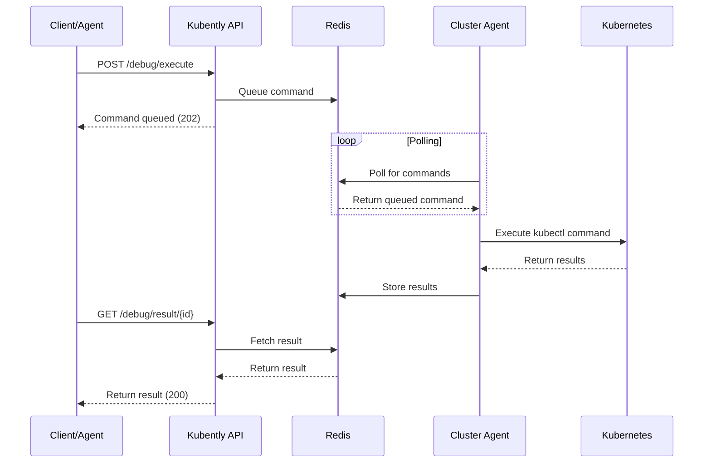

# Architecture

Kubently follows a modular, black-box architecture where each component exposes only its public interface while hiding implementation details. This design enables independent development, testing, and replacement of components without affecting the overall system. The system is LLM-agnostic, supporting multiple providers through the cnoe_agent_utils LLMFactory interface (currently including Google, Anthropic, and OpenAI).

## System Overview

### High-Level Architecture

```
┌─────────────────────────────────────────────────────────────────┐
│                         External Clients                         │
│                   (AI Services, CLI, Web UI, A2A)               │
└─────────────────┬───────────────────────────────────────────────┘
                  │ HTTPS
                  ▼
┌─────────────────────────────────────────────────────────────────┐
│                     Kubernetes Ingress/LB                        │
└─────────────────┬───────────────────────────────────────────────┘
                  │ Round-robin distribution
                  ▼
┌─────────────────────────────────────────────────────────────────┐
│                      Kubently API Pods                           │
│  ┌──────────┐  ┌──────────┐  ┌──────────┐  ┌──────────┐       │
│  │  Pod 1   │  │  Pod 2   │  │  Pod 3   │  │  Pod N   │  ...  │
│  └────┬─────┘  └────┬─────┘  └────┬─────┘  └────┬─────┘       │
│       └──────────────┴──────────────┴──────────────┘            │
│                   Redis Pub/Sub Channel                          │
└──────────────────────────────┬──────────────────────────────────┘
                               │
                  ┌────────────▼────────────┐
                  │      Redis Cluster       │
                  │    (Pub/Sub + State)     │
                  └────────────┬────────────┘
                               │ SSE Connection
                               ▼
                  ┌──────────────────────────┐
                  │   Kubently Executors      │
                  │  (One per K8s cluster)    │
                  └──────────────────────────┘
```

### Design Principles

1. **Black Box Modules**: Each module exposes only its interface, hiding implementation
2. **Primitive-First**: Everything flows through three core primitives: Command, Session, and Result
3. **Single Responsibility**: Each module has one clear job that one person can maintain
4. **Interface Stability**: APIs remain stable even if implementations change completely
5. **Replaceable Components**: Any module can be rewritten using only its public API

## Core Components

### Kubently API (Horizontally Scalable)

The API service orchestrates debugging sessions and command execution across multiple pods.

**Key Features:**
- **Horizontal Scaling**: Multiple pods with Redis pub/sub distribution
- **SSE Endpoint**: Real-time executor streaming via Server-Sent Events
- **A2A Support**: Full A2A protocol implementation with tool call interception
- **LLM Integration**: Multiple LLM providers supported through LLMFactory
- **Todo Management**: Built-in todo tool for systematic troubleshooting
- **Stateless Design**: All state in Redis for perfect scaling

**Endpoints:**
- `GET /executor/stream` - SSE connection for executors
- `POST /debug/execute` - Execute kubectl commands
- `POST /debug/session` - Create debugging session
- `POST /executor/results` - Receive command results
- `GET /health` - Health check
- `/a2a/*` - A2A protocol endpoints (mounted on main port)

**Performance:**
- ~50ms command delivery via SSE
- Supports 1000+ commands/sec
- Unlimited API pod replicas
- Real-time streaming with tool call visibility

### Kubently Executor (Per-Cluster)

SSE-connected component deployed in each target cluster for instant command execution.

**Key Features:**
- **SSE Client**: Instant command reception (no polling)
- **Dynamic Whitelist**: Configurable security modes
- **Auto-reconnection**: Resilient connection handling
- **Token Authentication**: Secure cluster identification

**Security Modes (Configurable via Helm):**
- `readOnly`: Safe read operations only (default)
- `extendedReadOnly`: Includes auth/certificate operations
- `fullAccess`: All operations (requires explicit acknowledgment)

**RBAC Configuration:**
- Fully customizable RBAC rules via Helm values
- Per-cluster security overrides supported
- Dynamic whitelist with runtime reloading

**Performance:**
- Instant command delivery via SSE
- Zero polling overhead
- Memory footprint < 128MB
- Automatic connection recovery

### Redis (Pub/Sub + State)

Redis handles message distribution and state management for the entire system.

**Usage:**
- **Pub/Sub Channels**: Command distribution to executors
- **Session State**: Active debugging sessions with metadata
- **Command Queues**: Per-cluster command queues
- **Results Cache**: Command execution results
- **TTL Management**: Automatic cleanup of expired data

**Channel Format:**
```
executor-commands:{cluster_id}  # Commands for specific executor
executor-results:{command_id}   # Command results
```

**Data Types Stored:**
- **Sessions**: Active debugging sessions with metadata
- **Command Queues**: Pending commands for each cluster
- **Results**: Command execution results and history
- **Agent Status**: Health and connectivity information

**Performance Characteristics:**
- In-memory storage for sub-millisecond access
- Pub/Sub for real-time notifications
- TTL-based automatic cleanup
- Optional persistence for durability

## Data Flow

### Command Execution Flow



### Session Lifecycle

1. **Session Creation**
   - Client requests new session for cluster
   - API validates cluster availability
   - Session metadata stored in Redis
   - Session ID returned to client

2. **Active Session**
   - Commands queued for execution
   - Agent polls and executes commands
   - Results cached with TTL
   - Session activity tracked

3. **Session Cleanup**
   - Automatic expiration after inactivity
   - Manual session closure
   - Resource cleanup in Redis
   - Agent notification of closure

## Security Architecture

### Authentication Layers

1. **API Authentication**
   - Bearer token authentication (X-API-Key header)
   - OAuth 2.0/OIDC support
   - API key validation
   - Rate limiting per key

2. **Executor Authentication**
   - Unique tokens per cluster (Authorization: Bearer header)
   - TLS support with cert-manager integration
   - Automatic token generation if not provided
   - Token rotation support

3. **Kubernetes RBAC**
   - Minimal required permissions
   - Read-only access only
   - Namespace-scoped when possible

### Command Security

```yaml
# Example RBAC for Kubently Agent
apiVersion: rbac.authorization.k8s.io/v1
kind: ClusterRole
metadata:
  name: kubently-agent
rules:
- apiGroups: [""]
  resources: ["pods", "nodes", "services", "endpoints", "events"]
  verbs: ["get", "list", "watch"]
- apiGroups: ["apps"]
  resources: ["deployments", "replicasets", "daemonsets"]
  verbs: ["get", "list", "watch"]
- apiGroups: ["networking.k8s.io"]
  resources: ["ingresses", "networkpolicies"]
  verbs: ["get", "list", "watch"]
```

### Network Security

- **API Service**: Exposed via LoadBalancer or Ingress
- **Agents**: Outbound connections only
- **Redis**: Internal cluster communication only
- **Optional**: Network policies for additional isolation

## Performance Characteristics

### Latency Targets

| Operation | Target | Typical |
|-----------|--------|---------|
| Session Creation | < 100ms | ~50ms |
| Command Queuing | < 50ms | ~20ms |
| Command Execution | < 500ms | ~200-300ms |
| Result Retrieval | < 50ms | ~10-20ms |

### Throughput Targets

| Metric | Target | Tested |
|--------|--------|--------|
| Concurrent Sessions | 100+ | 150+ |
| Commands/Second | 100+ | 200+ |
| API Requests/Second | 1000+ | 1500+ |

### Resource Usage

| Component | Memory | CPU |
|-----------|--------|-----|
| API Service | 200-500MB | 0.5-1.0 cores |
| Agent | 50-100MB | 0.1-0.3 cores |
| Redis | 100-500MB | 0.2-0.5 cores |

## Scalability

### Horizontal Scaling

**API Service:**
- Stateless design enables easy horizontal scaling
- Load balancer distributes requests
- Session affinity not required

**Agents:**
- One agent per cluster (not horizontally scaled)
- Agent restarts handled gracefully
- No shared state between agents

**Redis:**
- Redis Cluster for horizontal scaling
- Redis Sentinel for high availability
- Read replicas for read-heavy workloads

### Vertical Scaling

**Memory Scaling:**
- Redis memory scales with active sessions
- API memory scales with concurrent requests
- Agent memory remains constant

**CPU Scaling:**
- API CPU scales with request rate
- Agent CPU scales with command complexity
- Redis CPU scales with data operations

## High Availability

### API Service HA

```yaml
apiVersion: apps/v1
kind: Deployment
metadata:
  name: kubently-api
spec:
  replicas: 3
  strategy:
    type: RollingUpdate
    rollingUpdate:
      maxUnavailable: 1
      maxSurge: 1
  template:
    spec:
      containers:
      - name: api
        readinessProbe:
          httpGet:
            path: /health
            port: 8080
          initialDelaySeconds: 5
          periodSeconds: 5
        livenessProbe:
          httpGet:
            path: /health
            port: 8080
          initialDelaySeconds: 30
          periodSeconds: 30
```

### Redis HA

```yaml
# Redis Sentinel configuration
apiVersion: v1
kind: ConfigMap
metadata:
  name: redis-sentinel
data:
  sentinel.conf: |
    port 26379
    dir /data
    sentinel monitor mymaster redis-master 6379 2
    sentinel auth-pass mymaster your-redis-password
    sentinel down-after-milliseconds mymaster 5000
    sentinel parallel-syncs mymaster 1
    sentinel failover-timeout mymaster 10000
```

### Agent HA

- Agents automatically reconnect on failure
- Command queues preserved during agent restarts
- Health monitoring with automatic recovery

## Monitoring and Observability

### Metrics

**API Metrics:**
- Request rate and latency
- Session creation/closure rates
- Command execution times
- Error rates by endpoint

**Agent Metrics:**
- Command execution success/failure rates
- Queue depth and processing time
- Connection health to API
- Resource utilization

**Redis Metrics:**
- Memory usage and hit rates
- Connection counts
- Command execution times
- Pub/Sub message rates

### Logging

**Structured Logging:**
```json
{
  "timestamp": "2024-01-20T10:30:45Z",
  "level": "INFO",
  "service": "kubently-api",
  "session_id": "sess_abc123",
  "cluster_id": "prod-cluster",
  "command": "get pods",
  "execution_time_ms": 234,
  "correlation_id": "trace-xyz789"
}
```

### Distributed Tracing

- OpenTelemetry integration
- Correlation IDs across services
- Request flow visualization
- Performance bottleneck identification

## Future Architecture Enhancements

### WebSocket Support
- Real-time command streaming
- Bidirectional communication
- Reduced polling overhead

### Multi-Region Deployment
- API service in multiple regions
- Cross-region session replication
- Disaster recovery capabilities

### Advanced Caching
- Command result caching
- Cluster state caching
- CDN integration for static resources

### Plugin Architecture
- Custom command handlers
- Third-party integrations
- Extensible security policies